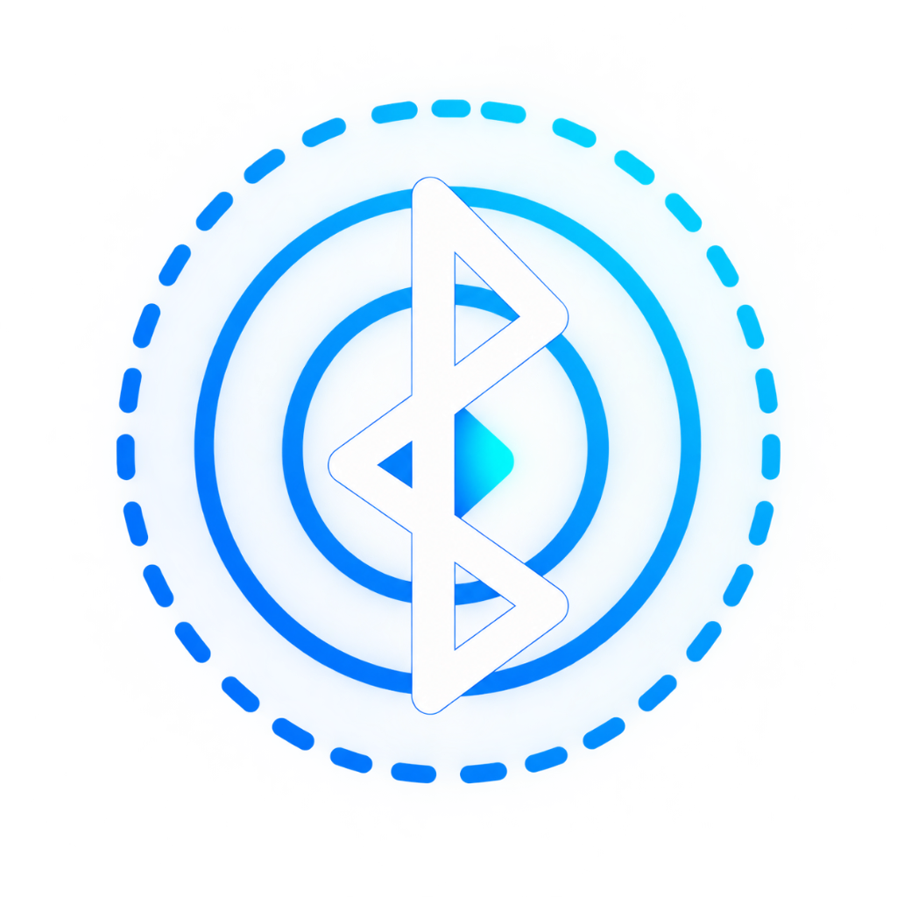

# BlueRadar - BLE Proximity Tracker



<pform](https://img.shields.io/badge/Platform-Android-green.svg)


BlueRadar adalah aplikasi Android yang memindai perangkat Bluetooth Low Energy (BLE) di sekitar pengguna secara real-time. Aplikasi ini memungkinkan pengguna untuk melihat daftar perangkat aktif, memantau kekuatan sinyal (RSSI), dan melacak kedekatan perangkat target menggunakan visualisasi berbasis zona jarak.

---

## 📱 Fitur Utama

### 1. **Dashboard Scanner**
- Pemindaian BLE real-time dengan tombol Start/Stop
- Daftar perangkat dengan informasi lengkap:
  - Nama perangkat
  - MAC Address
  - RSSI (dBm)
  - Estimasi jarak
  - Kategori sinyal dengan indikator warna
- Filter & pencarian:
  - Search by nama atau MAC address
  - Filter berdasarkan RSSI threshold (slider)
- Auto-sort berdasarkan sinyal terkuat

### 2. **Radar View**
- Pelacakan intensif untuk 1 perangkat
- Visualisasi zona jarak real-time
- Informasi detail:
  - Signal strength (RSSI)
  - Estimated distance
  - Signal category dengan warna
- Animasi radar untuk tracking

### 3. **Device History**
- Riwayat semua perangkat yang pernah terdeteksi
- Data tersimpan di database lokal (Room)
- Informasi meliputi:
  - Last seen timestamp
  - Last RSSI
  - Scan count
- Fitur delete per device atau clear all

---

## 🏗️ Arsitektur

Aplikasi ini dibangun menggunakan **Clean Architecture** dengan pola **MVVM (Model-View-ViewModel)**:

```
📦 com.example.blueradar
├── 📂 data                   # Data Layer
│   ├── ble/                  # BLE Scanner implementation
│   ├── local/                # Room Database
│   └── repository/           # Repository pattern
├── 📂 domain                 # Domain Layer
│   ├── model/                # Business models
│   └── util/                 # Utilities
├── 📂 di                     # Dependency Injection (Hilt)
└── 📂 ui                     # Presentation Layer
    ├── navigation/           # Navigation setup
    ├── screen/               # Compose screens + ViewModels
    └── theme/                # Material3 theme
```

---

## 🛠️ Tech Stack

| Layer | Technology |
|-------|-----------|
| **Language** | Kotlin |
| **UI** | Jetpack Compose + Material3 |
| **Architecture** | MVVM (ViewModel + StateFlow) |
| **Dependency Injection** | Hilt |
| **Database** | Room |
| **BLE** | Android Bluetooth LE API |
| **Navigation** | Navigation Compose |
| **Async** | Kotlin Coroutines + Flow |
| **Permissions** | Accompanist Permissions |
| **Min SDK** | API 26 (Android 8.0) |
| **Target SDK** | API 36 (Android 15) |

---

## 🚀 Setup & Instalasi

### Prasyarat
- Android Studio Hedgehog (2023.1.1) atau lebih baru
- JDK 11 atau lebih tinggi
- Android SDK API 26+
- Device atau Emulator dengan Bluetooth LE support

### Langkah Instalasi

1. **Clone repository**
   ```bash
   git https://github.com/tetraxion/blueradar_kotlin.git
   cd blueradar_kotlin
   ```

2. **Buka project di Android Studio**
   - File → Open → Pilih folder blueradar_kotlin

3. **Gradle Sync**
   - Android Studio akan otomatis sync dependencies
   - Tunggu hingga selesai

4. **Run aplikasi**
   - Pilih device/emulator
   - Klik Run ▶️ atau `Shift + F10`

---

## 📋 Permissions

Aplikasi membutuhkan permissions berikut:

### Android 12+ (API 31+)
- `BLUETOOTH_SCAN` - Untuk scanning perangkat BLE
- `BLUETOOTH_CONNECT` - Untuk koneksi BLE
- `ACCESS_FINE_LOCATION` - Required untuk BLE scanning di Android

### Android 11 dan di bawahnya (API ≤ 30)
- `BLUETOOTH` - Untuk akses Bluetooth
- `BLUETOOTH_ADMIN` - Untuk administrasi Bluetooth
- `ACCESS_FINE_LOCATION` - Required untuk BLE scanning

**Note:** Aplikasi akan meminta permission secara otomatis saat pertama kali dijalankan.

---

## 📊 Kategori Sinyal (RSSI → Distance Mapping)

| RSSI (dBm) | Kategori | Estimasi Jarak | Warna |
|------------|----------|----------------|-------|
| -10 s/d -30 | Sangat Kuat | < 1 meter | 🟢 Hijau Terang |
| -30 s/d -50 | Kuat | 1 – 3 meter | 🟢 Hijau |
| -50 s/d -70 | Cukup / Baik | 3 – 10 meter | 🟡 Kuning |
| -70 s/d -80 | Lemah | 10 – 20 meter | 🟠 Oranye |
| -80 s/d -90 | Sangat Lemah | > 20 meter | 🔴 Merah |
| < -90 | Sinyal Hilang | Terputus | ⚪ Abu-abu |

---

## 🎯 Use Cases

1. **Mencari perangkat Bluetooth yang hilang**
   - Track jarak real-time ke perangkat (earbuds, smartwatch, dll)
   
2. **Testing BLE devices**
   - Developer dapat test jangkauan sinyal perangkat BLE
   
3. **Proximity detection**
   - Monitor kedekatan perangkat untuk automation

---

## 🔧 Build APK

### Debug APK
```bash
./gradlew assembleDebug
```
Output: `app/build/outputs/apk/debug/app-debug.apk`

### Release APK
```bash
./gradlew assembleRelease
```
Output: `app/build/outputs/apk/release/app-release.apk`

---

## 📐 Estimasi Jarak

Aplikasi menggunakan **Log-Distance Path Loss Model** untuk menghitung estimasi jarak dari nilai RSSI:

```kotlin
distance = 10^((txPower - rssi) / (10 * n))
```

**Parameter:**
- `txPower`: -59 dBm (standar BLE at 1 meter)
- `n`: 2.0 (path loss exponent)

**Note:** Estimasi jarak bersifat approximate dan dipengaruhi oleh:
- Penghalang fisik (dinding, furnitur)
- Interferensi sinyal
- Karakteristik hardware perangkat

---

## ⚠️ Known Issues & Limitations

1. **Estimasi jarak tidak akurat di dalam ruangan**
   - Solusi: Kalibrasi TX Power per device untuk akurasi lebih baik

2. **Background scanning dibatasi Android**
   - Scanning otomatis berhenti saat app di background
   - Ini adalah limitasi Android untuk menghemat baterai

3. **Beberapa device BLE tidak mengirimkan nama**
   - Akan tampil sebagai "Unknown Device"

---

## 🧪 Testing

### Manual Testing Checklist

- [ ] Permission flow (grant/deny)
- [ ] Bluetooth on/off handling
- [ ] Scan start/stop
- [ ] Search & filter devices
- [ ] Navigation ke Radar View
- [ ] Real-time RSSI update
- [ ] History persistence
- [ ] Delete history
- [ ] App rotation (configuration changes)
- [ ] App background/foreground lifecycle

---

## 📄 License

Aplikasi ini dibuat untuk keperluan study case Mobile Engineer.

---

## 👤 Author

**Study Case: Mobile Engineer**  
Goodeva Technology

---

## 📞 Support

Jika ada pertanyaan atau issue, silakan buat GitHub Issue atau hubungi tim technical.

---

**Built with ❤️ using Kotlin & Jetpack Compose**
